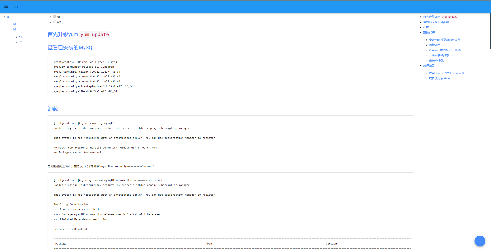

# MarkHelper

> Markdown助手
> 
> 将整个Markdown文件夹生成为静态HTML

## 启动

- WINDOWS执行 `run.bat`
- LINUX执行 `run.sh`

**可使用`TAB`提示命令**

## 公共命令

``` text
Built-In Commands
        clear: Clear the shell screen.
        exit, quit: Exit the shell.
        help: Display help about available commands.
        history: Display or save the history of previously run commands
        script: Read and execute commands from a file.
        stacktrace: Display the full stacktrace of the last error.
```

## `help` 获取帮助

``` text
NAME
	help - Display help about available commands.

SYNOPSYS
	help [[-C] string]  

OPTIONS
	-C or --command  string
		The command to obtain help for.
		[Optional, default = <none>]
```

## `html` 生成HTML，支持无限层级的markdown文件夹

``` text
NAME
	html - 生成HTML, 支持无限层级的markdown文件夹. 可直接使用命令 'html [路径]' 而无需显式拼写命令选项, 其他选项也可省略但值的顺序不可变

SYNOPSYS
	html [-i] string  [[-o] string]  [[-n] string]  [[-t] string]  

OPTIONS
	-i or --docDirPath  string
		MD文档目录绝对路径, 反斜杠需自行转义, 默认 同级目录生成 [MD目录同名]-html-[date] 的文件夹
		[Mandatory]

	-o or --outputDirPath  string
		HTML文档输出目录绝对路径, 反斜杠需自行转义, 默认 同级目录生成 [MD目录同名]-html-[date] 的文件夹
		[Optional, default = <none>]

	-n or --targetDirName  string
		输出目录名称
		[Optional, default = <none>]

	-t or indexTitle  string
		首页标题
		[Optional, default = <none>]
```

## 测试

Markdown文档结构

``` text
C:\Users\youthred\Desktop\a\a1.md
C:\Users\youthred\Desktop\a\b\b1.md
C:\Users\youthred\Desktop\a\b\b2.md
C:\Users\youthred\Desktop\a\b\d\d1.md
C:\Users\youthred\Desktop\a\b\d\d2.md
```

启动执行

``` shell
shell:>html C:\\Users\\youthred\\Desktop\\a
生成位置: C:\Users\youthred\Desktop\a-html-20220916224334\
shell:>
```

效果


